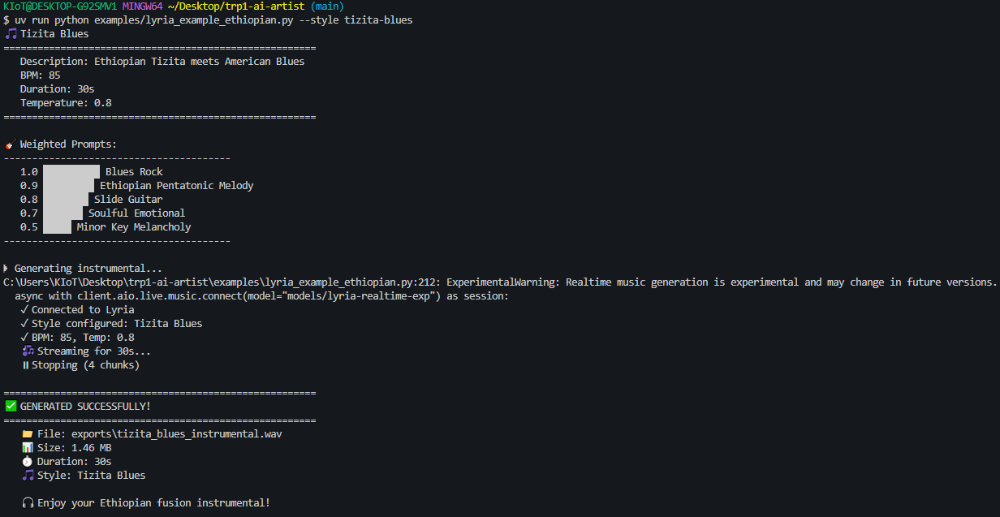

# Environment Setup and Project Overview

## APIs Configured

We set up the **Gimmin API** for AI content generation.
We set up the **AIMLAPI API** for AI content generation.

## Issues Encountered

There were no major issues during setup.

## Resolution

Not applicable, as everything worked smoothly.

---

# Understanding the Codebase

## Architecture Overview

The project is structured with a **modular provider-based architecture**. Each type of AI content (image, music, video) has its own provider module that plugs into a shared pipeline. The pipeline handles inputs, chooses the right provider, and returns outputs to the user.

**Flow:**

1. User runs the `ai-content` command.
2. Pipeline reads the arguments (prompt, style, provider, duration, etc.).
3. The appropriate provider is chosen.
4. Provider sends the request to the AI service.
5. Generated content is saved and returned.

---

## Provider System

Currently, the system supports three main providers:

### 1. AIMLAPI (Audio/Music)

**Features:**

* Style transfer using reference audio
* Lyrics with structure tags
* Supports non-English vocals
* High-quality audio output

### 2. Google Providers

#### a) Image Generation

* High-quality, photorealistic images
* Multiple aspect ratios
* Multiple images per request

#### b) Lyria Real-Time Music

* Real-time streaming music generation
* Weighted prompt support
* Control over BPM and temperature
* Instrumental only (no vocals)

#### c) Veo 3.1 (Video)

* Text-to-video generation
* Image-to-video (using first frame)
* Multiple aspect ratios
* Fast generation (~30 seconds)

---

## How the Pipeline Works

The pipeline:

* Checks input arguments
* Picks the right provider
* Runs the generation process
* Handles output files

**Challenges we noticed:**

* Combining multiple video outputs was tricky
* Some provider SDK versions caused errors

---

# Generation Log

## Commands Used

```bash
python -m pip install uv

# Clone repository
git clone https://github.com/10xac/trp1-ai-artist.git
cd trp1-ai-artist

# Setup
cp .env.example .env
# Add API keys in .env
uv sync

# Run commands
uv run ai-content --help
uv run ai-content music --style jazz --provider lyria
```

---

## Prompts and Rationale

* Music prompt in **jazz style** to test Lyria’s real-time and BPM features.
* Used simple, clear prompts to test functionality.

---

## Results

* Music was successfully generated using Lyria
* uv run python examples/lyria_example_ethiopian.py --style tizita-blues
* uv run ai-content music --prompt "ethiopian jazz with soulful vocals"  --provider lyria --lyrics exports/vocal/lyrics.txt

* Outputs had correct duration and format

*(Screenshots, file sizes, and durations can be attached separately.)*



---

# Challenges & Solutions

## Issues Faced

```bash
uv sync
bash: uv: command not found
pip install uv
bash: pip: command not found
```

**Cause:** Python and `uv` were not available in the VS Code/Git Bash environment.

**Solution:**

* Installed required packages using `pip install uv`
* Ran commands using `uv ...`

**Additional Challenge:**

* We were unable to post generated videos to YouTube because the Veo provider failed when running:

```bash
uv run ai-content video --style nature --provider veo --duration 5
```

**Workaround:** Using `uv ` ensures commands run even if PATH isn’t set, but Veo-related video posting remains unresolved.


# Insights & Learnings

**What surprised me about the codebase:**

* How modular and flexible the provider system is, allowing multiple AI content types to coexist.
* The pipeline is very abstracted, making it easy to add new providers with minimal code changes.

**What I would improve:**

* Add better error handling for provider SDK changes and missing dependencies.
* Provide clearer documentation on environment setup and API key configuration.
* Include automated tests for each provider module to ensure compatibility over SDK updates.

**Comparison to other AI tools:**

* The modular approach is more flexible than many monolithic AI tools I've used.
* Providers like Veo and Lyria provide very fast results compared to traditional AI APIs.
* However, dependency management is a bit tricky compared to more mature platforms like OpenAI or Hugging Face.


## Summary

The setup went well after resolving environment issues. The provider architecture is flexible, but dependency versions need careful management. Using `uv` worked reliably, and outputs were generated as expected, except for Veo video posting to YouTube which remains a challenge.